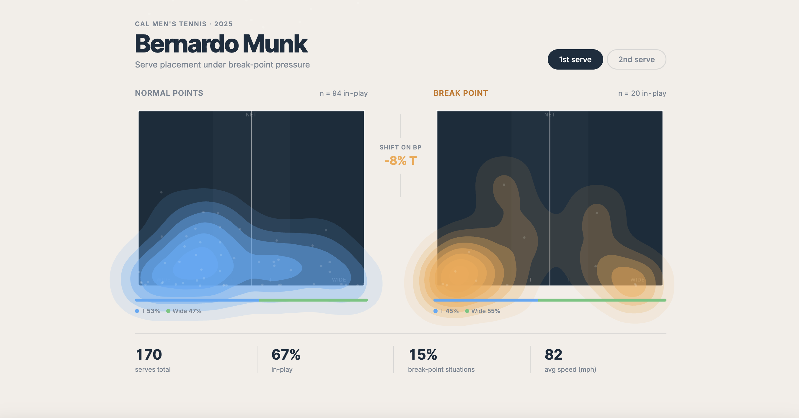

# Bernardo Munk-Mesa — Serve Analysis

Spatial analysis of serve placement across 3 matches for a Cal Men's Tennis player, built for the coaching staff during the 2025 pre season. Uses SwingVision Pro tracking data.

**The question:** Does Bernardo's serve placement shift under break-point pressure?

**Finding:** On 1st serve, he goes 8% more toward Wide and 8% less toward the T on break points — a consistent tactical shift across matches.

---

## Visualization

Interactive D3.js court diagram with kernel density estimation on serve landing coordinates. Side-by-side comparison of serve placement on normal points vs. break-point situations.

→ [Live demo](https://annabhogra.github.io/Tennis-Analytics/viz/)



## Pipeline

```
data/                  raw SwingVision Pro exports (.xlsx)
pipeline/
  ingest.py            load + normalize Shots and Points sheets
  features.py          break-point detection (two strategies)
  export.py            full pipeline → viz/data.json
viz/
  court.js             D3 court + contour density rendering
  index.html / style.css
```

**Break-point detection** uses two strategies depending on data quality:
- When SwingVision exports a Points sheet with score data, uses the `Break Point` flag directly
- When score wasn't tracked (Set/Game = 0), reconstructs game boundaries by detecting server changes across sequential points, then walks point scores

## Run it

```bash
pip install -r requirements.txt
cd pipeline && python export.py   # → writes viz/data.json

cd ../viz && python3 -m http.server 8765
# open http://localhost:8765
```

## Data

3 SwingVision Pro match exports (`.xlsx`), not included in this repo. Place files in `data/` and run `export.py --player "Bernardo Munk-Mesa"`.

---

Built as part of the Cal Sports Analytics Club, Fall 2025.
Originally built in Dec 2025 and re-uploaded after repo loss
